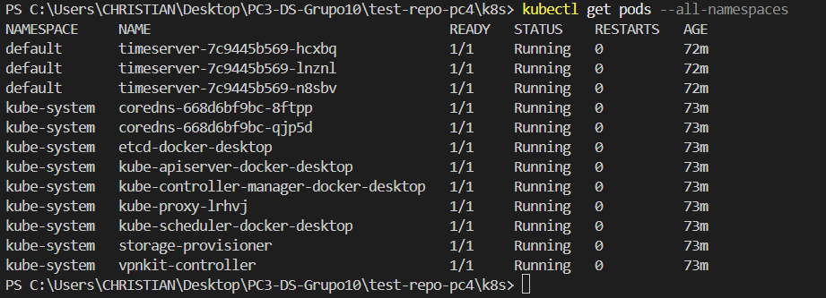
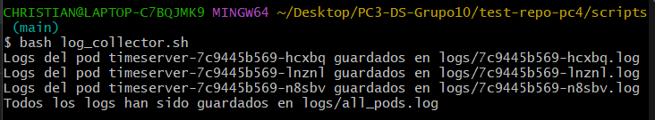
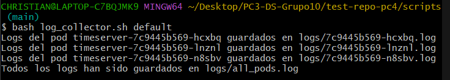
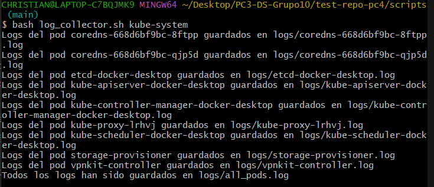
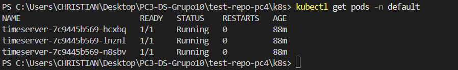
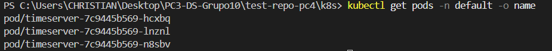
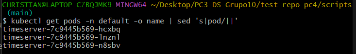

# Script bash que recolecta todos los logs de los Pods en un namespace específico

## Namespace
Según la documentación de [vmware](https://www.vmware.com/topics/kubernetes-namespace#:~:text=Los%20espacios%20de%20nombres%20son%20una%20forma%20de%20organizar%20cl%C3%BAsteres%20en%20subgrupos%20virtuales) un namespace **es la forma de organizar clústeres en subgrupos virtuales** así que en este contexto, en lo que debemos enfocarnos es en buscar todos los pods que se alojan en el namespace `default` ya que por defecto se agrupan ahí.

## Explicación de código
### Namespace específico
Para definir el namespace a usar, lo que haremos será primero al momento de ejecutar el script, elegir el namespace a usar, con el siguiente comando
```bash
namespace=${1:-default}
```
Esto basicamente lo que nos dice es, `Al ejecutar el comando bash log_collector.sh, especifica el nombre del namespace a usar, y en caso no especifiques, usaré el namespace default`.
Y la mejora manera de probar esto, es mediante la ejecución del comando:
Primero verificamos los namespaces del kubernetes con el comando:
```bash
kubectl get pods --all-namespaces
```


Ahora para ejecutar, haremos las tres maneras:
**1.- Ejecutar sin especificar el namespace**


**2.- Ejecutar especificando a default como namespace**


**3.- Ejecutar especificando a kube-system como namespace**


### kubectl get pods -n default
Ahora según lo anterior el comando de get pods, ahora ya tendrá el valor del namespace especificado, y esto nos devolverá solo los pods que pertenecen a ese namespace `kubectl get pods -n "$namespace"`, el cuál nos dará una respuesta parecida a la siguiente


---

Podemos notar que el resultado es obtener todos los pods con las columnas `NAME`, `READY`, `STATUS`, `RESTARTS` y `AGE` pero lo que nos interesa, es solo el nombre, ya que para verificar los logs, necesitamos el nombre del **Pod**

### kubectl get pods -n default -o name
Así que debido a esa necesidad, se empieza con el filtrado de la respuesta al comando, ejectuando el siguiente comando le pedimos al sistema que nos muestre solo la columna `NAME` de la respuesta general al ejecutar `kubectl get pods`, modificando el comando a `kubectl get pods -n "$namespace" -o name` obteniendo como respuesta lo siguiente:



### kubectl get pods -n "$namespace" -o name | sed 's|pod/||'
A pesar de tener un gran avance, para recolectar los logs, decidí por crear un archivo **.log** por cada pod.
#### Idea de uso:
El **.log** de cada pod se identificará con la última parte del nombre del pod, la cuál es la única que varía y así sea más rápida su identificación, así que como se vió en la imagen anterior, al solicitar que nos muestre solo la fila `NAME`, esta respuesta, viene acompañada de un `pod/` lo cual no nos sirve para identificar el pod, por lo que usamos `sed 's|pod/||` que se encarga de que al momento de obtener la respuesta, esta respuesta se muestre pero sin el comienzo `pod/` y así nos quedamos con solo en nombre del pod, y ya tenemos listo para usar `kubectl logs`



Las siguientes líneas solo se encargan de leer los **Pods** que se recogieron y guardar en su archivo correspondiente

### Creación de archivo log (Individual y General)
```bash
kubectl logs "$pod" -n "$namespace" | tee -a "logs/$(echo "$pod" | sed 's|timeserver-7c9445b569-||').log" >> "logs/all_pods.log"
```
En esta línea del script, lo que hacemos es aplicar el comando `kubectl logs` el cuál se encarga de recolectar los logs del pod que se encuentra en el namespace especificado.
La segunda parte `tee -a` lo que hace es mostrar en pantalla la respuesta, pero además de eso, guardar en el archivo individual, donde podemos ver que la parte del comando que indica luego del sed, es para eliminar el valor repetido de esos pods y obtener solo el valor distinto del nombre, para así se creen sus archivos con su nombre respectivo, y por último al terminar, toda esa respuesta, se va a guardar en `all_pods.log` y con esto se termina la parte de recolectar logs

# Registar eventos
Para esta parte del script, lo único que haremos será ejecutar el comando
```bash
kubectl get events -n "$namespace"
```
Y la respuesta que de, se guardará en el archivo all_pods.log

# Instrucciones
Primero lo que se tiene que hacer, es que al crear el script, nos dirigimos a la carpeta scripts que es donde está `log_collector.sh` y ejecutamos:
```bash
chmod +x log_collector.sh
```
El cuál sirve para volver ejecutable al archivo bash
---
Ahora para ejecutar el comando, lo único que se debe de hacer es ejecutar el siguiente comando en caso estés dentro de la carpeta scripts:
```bash
bash log_collector.sh
```
Si se está en la carpeta raiz, la única diferencia al comando será agregar la carpeta scripts:
```bash
bash scripts/log_collector.sh
```

## Ejecutar con namespace específico
Ahora como la rúbrica indicaba un namespace específico, tal como se indico anteriormente, al momento de ejecutar el script, solo le agregamos el namespace que queremos porque en caso de no agregar, por defecto se realizará al namespace default:
```bash
bash log_collector.sh default
```
Eso es en caso querramos ese namespace, pero si queremos usar otro namespace, reemplazamos default por el namespace requerido y ejecutamos el script
