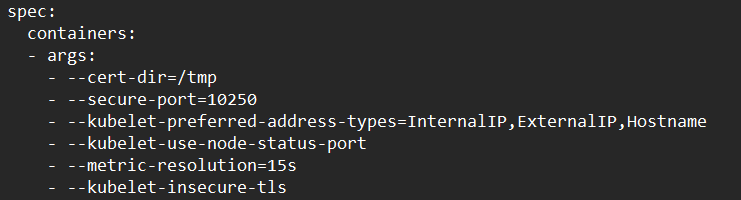
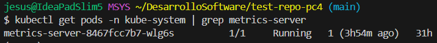
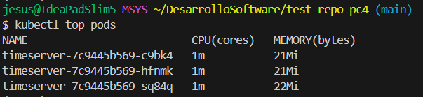
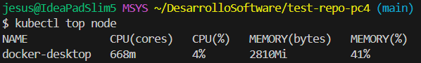

# Recolector de métricas de los Pods y Nodos

Para obtener estás métricas(uso de CPU, memoria) usaremos `kubectl top`.  Ahora para que esto nos funcione necesitamos tener `metrics-server` instalado en nuestro clúster.

1. Verificamos nuestro clúster actual, con el comando `kubectl config current-context`, en nuestro caso es docker-desktop. Luego verificamos si `metrics-server` está instalado, lo cual sabemos que aún no lo tenenmos.
2. Ya que nuestro clúster es docker-desktop, procedemos a instalar `metrics-server` de la siguiente manera. 
    ```sh
    # Descargar e instalar la versión más reciente
    kubectl apply -f https://github.com/kubernetes-sigs/metrics-server/releases/latest/download/components.yaml

    # Editamos el deployment
    kubectl edit deployment metrics-server -n kube-system
    ```
    Al ejecutar el último comando se nos abrirá un editor de texto. En el cual tenemos que buscar la sección
    ```yaml
    spec:
      containers:
      - args:
        - --cert-dir=/tmp
        - --secure-port=4443
        - --kubelet-preferred-address-types=InternalIP,ExternalIP,Hostname
        - --kubelet-use-node-status-port
        - --metric-resolution=15s
    ```

    Al encontrarlo añadimos `- --kubelet-insecure-tls`.

     

3. Guardamos y salimos. Comprobamos que hayamos hecho todos los pasos correctamente y por ende esté instalado correctamente.

    

    - kubectl top pods

        

    - kubectl top node

        

## Implementación metric_collector.py

