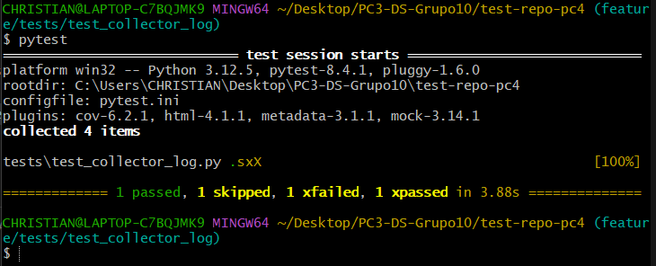

# Aplicación de marcas (xfail, skip) para pruebas de recolección de logs

Para realizar estas pruebas, lo primero que se hará será importar las funciones que se crearon en [log_collector.py](../scripts/log_collector.py) y sobre la cuál haremos uso de las marcas **xfail** (para pruebas que de antemano se saben que van a fallar, es decir, se espera que halla error y en este contexto podría ser, porque no existe el namespace elegido), **skip** (para omitir esa prueba por varios motivos y en este contexto, podría ser poque aún no están disponibles los pods para un namespace determinado)

## Prueba sin marca
Para comenzar con el testeo, primero haremos una prueba que sabemos que pasará, la cuál trata de usar el namespace `default`, y de acuerdo a esto, va a usar la función `get_pods(namespace)` para obtener los pods y así guardarlo en la variable **pods**, y como no es necesario usar la función `collect_logs` lo que hacemos es verificar que esta variable **pods** no está vacía `len(pods) > 0`, que sea de tipo **list** `isinstance(pods, list)`, que tenga un valor asignado, no sea **None** `pods is not None` y de acuerdo a esto, se verificará si hay erro o no, porque si hay un elemento en **pods** este elemento significa que exite en ese namespace, y no habrá problema al verificar su log.

## Prueba con marca skip
En esta prueba, no importa que contenga la prueba, ya que si o si se va a excluir sin importar si falla o nop, por ello es que notamos que su lógica dentro de la función, es la misma que la de `test_get_existent_logs`, pero al momento de ejecutar pytest, omitirá esta prueba

## Prueba con marca xfail - Falla esperada 
Para esta prueba, lo que buscamos es obtener un resultado fallido, forzar un fallo, es decir, hacer que al momento de ejecutar las funciones, este nos de error, y para esto se creó previamente **namespace2**, una variable que tiene como valor `inexsitent_pods` con el objetivo de tener un nombre de namespace que no exista, para así al momento de realizar `get_pods(namespace2)` nos de un error porque no hay pods agrupados en ese namespace, por lo que al realizar `pods = get_pods(namespace2)` lo que obtenemos es que **pods** no tenga un valor asignado y al momento de buscar su log con `collect_logs(pods[0], namespace=namespace2)` este nos dará error ya que **pods** es None o una lista vacía

## Prueba de marca xfail - Aprobación no esperada
La diferencia que tiene est prueba con la anterior, es que de por si, con la marca xfail se avisa al sistema que la función va a fallar, pero **¿Qué pasa si la prueba no falla y se ha avisado al sistema que si?** pues la verdad, no pasa nada, lo único es que al momento de ejecutar las pruebas, la notación de xfail será distinta a cuando se espera que falle y falla, ya que cuando la prueba falla y se usa xfail, se denota con una **x** (xfail) pero cuando la prueba no falla y se usa xfail, se denota con una **X** (xpassed)

# Ejecución de pytest

